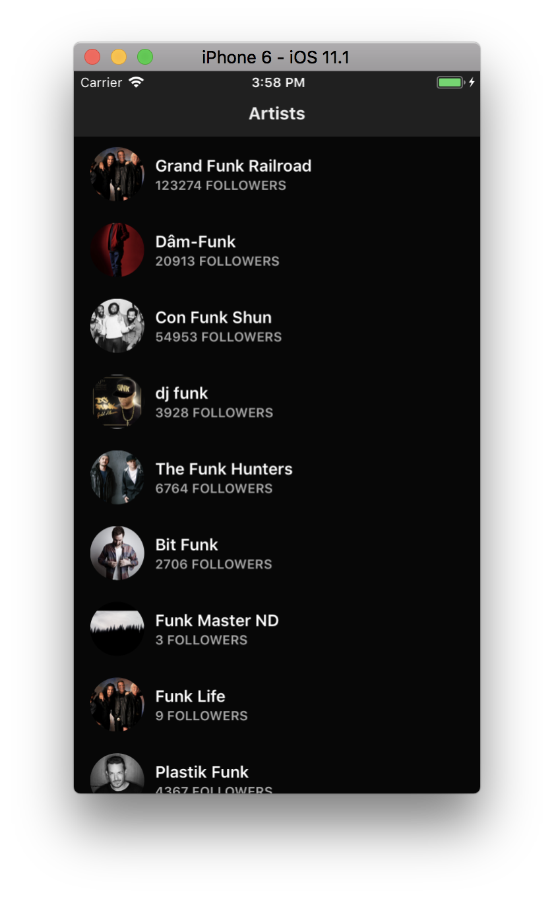

# Underscope React Native Exercise

## Intro

This is our React Native exercise for basic skills evaluation.

### Goal

The main goal of this exercise is to assess the following:

- Coding skills
- Research ability
- Written communication
- Autonomy
- Expectation management and interaction with us
- Attention to details
- Customer orientation

### Tasks

What we want you to do is:

1. Solve [the exercise](#exercise) you will find below
2. Track the effort you invest (at least the total hours)
3. Deliver the solution in this repository
4. Show us what you did in a short video call (less than 30 minutes)

We expect you to deliver this in ~7 days, but please tell us if you think it will take you more time.  
We know you're probably not dedicated to this full-time and that's why we ask you to track the effort, so we can see the real time invested.

## Exercise

### Challenge 1

Create a React Native app that shows a list of _artists_:

- The data **must** be consumed from [this endpoint](https://s3-us-west-2.amazonaws.com/io.underscope.exercises/artist-list.json) that emulates the Spotify API for a _search_ request (you can find the spec [here](https://developer.spotify.com/web-api/search-item/)).

- The app **must** work in at least one platform and ideally **should** work in both, Android and iOS.

- The UI **must** be copied from the following image
  

### Challenge 2

Create a detail view that will be displayed in a _modal_ when user taps on each row.

- The detail view **must** reuse the same component you use for each artist item in the list, and display it as a header.

- The content and style of that view is up to you. Get creative! :)
